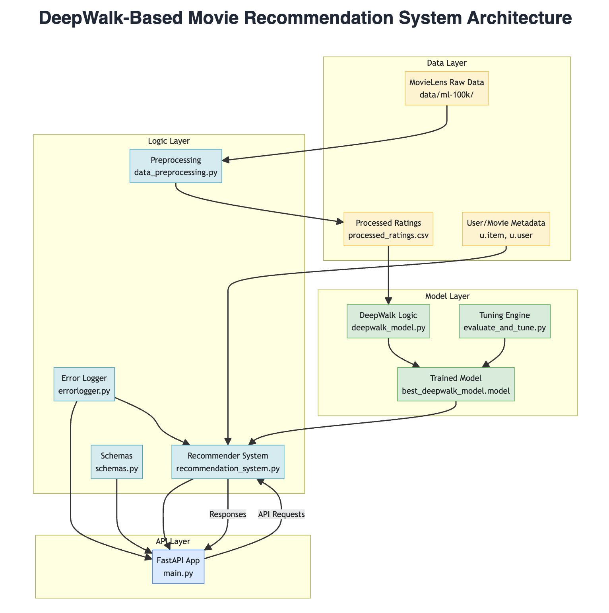

# DeepWalk Movie Recommendation Engine

A FastAPI-powered movie recommendation system that leverages DeepWalk graph embeddings on the [MovieLens 100k dataset](https://files.grouplens.org/datasets/movielens/ml-100k.zip).

---

## Features

- Graph-based Recommendations using DeepWalk for learning embeddings from user-movie interactions.
- FastAPI REST Endpoints for interactions, recommendations, and listing movies.
- Hyperparameter Tuning for optimizing DeepWalk training.
- Structured Logging for traceability and debugging.
- Comprehensive Testing using Pytest.

---

## System Architecture



### Layer Overview

- **Data Layer**: Handles user profiles, movie metadata, and interaction logs. These inputs form the basis for graph construction and embedding training.
- **Logic Layer**: Processes user input and applies similarity calculations to produce ranked movie recommendations.
- **Model Layer**: Encapsulates the DeepWalk model training, tuning, and embedding generation using the interaction graph.
- **API Layer**: Exposes endpoints for external interaction. Bridges frontend consumers with backend logic and models.
- **Logging Layer**: Captures system events and errors to aid monitoring and debugging.

---

## Project Structure

```plaintext
deepwalk_recommender/
├── ALGORITHM_WRITEUP.md
├── data/
│   ├── ml-100k/
│   ├── ml-100k.zip
│   └── processed_ratings.csv
├── Makefile
├── models/
│   └── deepwalk_model.model
├── poetry.lock
├── pyproject.toml
├── README.md
├── recommendations_output.json
├── requirements.txt
├── src/
│   └── deepwalk_recommender/
│       ├── __init__.py
│       ├── config.py
│       ├── data_preprocessing.py
│       ├── deepwalk_model.py
│       ├── evaluate_and_tune.py
│       ├── main.py
│       ├── recommendation_system.py
│       └── schemas.py
└── tests/
    ├── __init__.py
    ├── test_data_processing.py
    ├── test_deepwalk_model.py
    ├── test_evaluate_and_tune.py
    ├── test_main.py
    └── test_recommendation_system.py
```

---

## Setup Instructions

### Prerequisites

- Python 3.11+
- Poetry (for dependency management)

### 1. Create Virtual Environment

```bash
python -m venv venv
source venv/bin/activate
```

### 2. Install Dependencies
```bash
pip install -r requirements.txt
```

or

```bash
poetry install
```

**Note**: for a more streamlined setup, consider using `Makefile` commands to automate these steps. Simply run `make install-fast` to install dependencies and `make dev` to start the server in development mode. For production, use `make prod`.

### 3. Download & Preprocess Data

```bash
# download the data/ml-100k.zip
wget https://files.grouplens.org/datasets/movielens/ml-100k.zip
# Create the data path in the project's root directory
mkdir -p data
# Unzip the downloaded data into the data directory
unzip ml-100k.zip -d data/
# run the data preprocessing script to process the data and extract the relevant field
python src/deepwalk_recommender/data_preprocessing.py
```

### 4. Train & Tune DeepWalk

```bash
python src/deepwalk_recommender/evaluate_and_tune.py
```

### 5. Start API Server

```bash
python src/deepwalk_recommender/main.py
```

### Alternative Setup (via Makefile)

```bash
# Install dependencies
make install-fast
# Start server (dev mode)
make dev
# Start server (production mode)
make prod
```

---

## API Endpoints

### 1. GET /

Returns API version info.

### 2. POST /interactions

Add a new user-movie interaction.

```json
{
  "user_id": 1,
  "movie_id": 100,
  "rating": 4.5
}
```

### 3. GET /recommendations/{user_id}

Returns personalized recommendations with metadata:

```json
{
  "user_id": 1,
  "user_info": {
    "age": 24,
    "gender": "M",
    "occupation": "technician",
    "zip_code": "85711"
  },
  "recommended_items": [
    {
      "similar_movie_id": 1616,
      "title": "Desert Winds (1995)",
      "genres": [
        "Drama"
      ],
      "score": 2.84,
      "prob": 61,
      "explanation": "Recommended because you liked: Get Shorty (1995), Copycat (1995)",
      "popularity": "Hidden gem"
    }
  ]
}
```

### 4. GET /items

Returns list of all movies.

---

### Example Usage

```bash
curl http://localhost:8000/                             # Check API
curl http://localhost:8000/items                        # Get movies
curl http://localhost:8000/recommendations/1            # Get recommendations for the specified user_id
curl -X POST http://localhost:8000/interactions \
     -H "Content-Type: application/json" \
     -d '{"user_id": 1, "movie_id": 100, "rating": 4.5}' # Add new user interaction
```

---

## Testing and Code Quality

### Testing
Run unit and integration tests:

```bash
pytest --tb=short -q --cov=src --cov-report=term-missing --cov-report=html:coverage
```

or

```bash
make test
```

### Code Quality and Coverage

To ensure high code quality and maintainability, `SonarQube` was utilized for static code analysis.

The project adheres to best practices and common coding standards. The detailed code coverage results are available in the `coverage` directory.

The results of the unit testing and code coverage are presented below:

```plaintext
============================================================================================= tests coverage ==============================================================================================
____________________________________________________________________________ coverage: platform darwin, python 3.12.11-final-0 ____________________________________________________________________________

Name                                                Stmts   Miss  Cover   Missing
---------------------------------------------------------------------------------
src/__init__.py                                         0      0   100%
src/deepwalk_recommender/__init__.py                    0      0   100%
src/deepwalk_recommender/config.py                     15      0   100%
src/deepwalk_recommender/data_preprocessing.py         24      9    62%   74-87, 93-99
src/deepwalk_recommender/deepwalk_model.py             58     39    33%   88-98, 126-143, 170-179, 183-216
src/deepwalk_recommender/error_logger.py               88     17    81%   156-157, 190-191, 260-271, 287, 296-303
src/deepwalk_recommender/evaluate_and_tune.py         139      6    96%   82, 375-379
src/deepwalk_recommender/main.py                       72     12    83%   56-78, 281-283
src/deepwalk_recommender/recommendation_system.py     105      3    97%   238, 240, 242
src/deepwalk_recommender/schemas.py                    23      0   100%
---------------------------------------------------------------------------------
TOTAL                                                 524     86    84%
Coverage HTML written to dir coverage
48 passed, 1 warning in 5.62s
```

---

## Technical Notes

### Scalability

- Handles large data via sparse matrices.
- Stateless API: horizontally scalable.

### Performance

- Precomputed embeddings, vectorized similarity.
- Parallelized random walk generation.

### Future Enhancements

The following enhancements can be considered in the future for a real-life scenario:

- Real-time updates
- Cold-start handling
- Content-based hybrid filtering
- A/B testing for strategies

---

## Dependencies

- FastAPI, Uvicorn
- Gensim, NetworkX, NumPy, Pandas
- Scikit-learn, Pytest
- (Optional) TensorFlow for future extensions

---

## License

This project is provided for educational and evaluation purposes as part of a technical assessment.

---